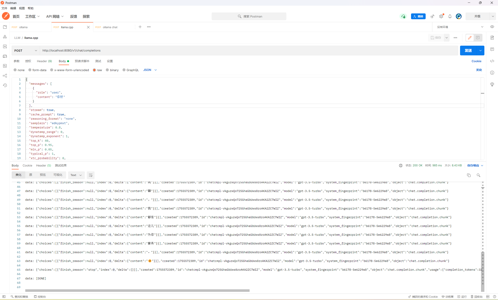
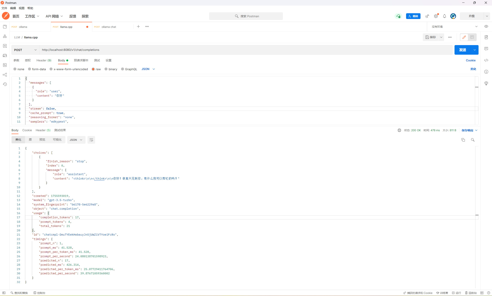

# LLM — 本地私有化部署 + OpenAI Compatible 接口 + 多客户端示例（Go）

> 目标：在本地私有化部署大模型，开放 **OpenAI Compatible 标准协议** 的服务接口，并用 **LangChain-Go**、**go-openai**、**openai-python** 等多种客户端发起请求（附 Postman / cURL 示例）。

---

## ✨ 功能概览

- ✅ 两种本地部署方式：
  - **Ollama**（便捷式一键拉模型）
  - **llama.cpp**（`llama-server` 提供 **OpenAI 兼容**的 `/v1/chat/completions`）
- ✅ 提供 **OpenAI Compatible** 的 HTTP API，方便直接复用各类 OpenAI 客户端/SDK。
- ✅ 演示各类客户端调用：
  - Postman
  - cURL
  - LangChain-Go 框架
  - go-openai 框架
  - openai python 框架
  - AutoGen python 框架
  - OpenAI Agent SDK Python 框架

---

## 📦 仓库结构

```bash
llm/
├── LangChainGo/      # LangChain-Go
│ └── main.go
├── OpenAIGo/         # OpenAI-Go
│ └── main.go
├── OpenAIPython/     # OpenAI Python
│ └── main.py
├── AutoGen/          # AutoGen Python
│ └── main.py
└── OpenAI-Agent-SDK/  # OpenAI Agent SDK Python
  └── main.py
```

---

## 🚀 私有化部署

### 方案一：Ollama（上手最简单）

1. 安装 [Ollama](https://ollama.com/download)，可选择不同平台。
2. 进行模型的选择，例如 `deepseek-r1:8b`，然后在命令行输入：
   ```
   ollama run deepseek-r1:8b
   ```
   即可下载模型并启动对话
3. 交互式对话启动的同时，Ollama 也提供访问接口

- POST http://localhost:11434/api/generate ，是 **Ollama 原生**生成接口（**不是** OpenAI 规范）
- POST http://localhost:11434/v1/chat/completions ，是 **OpenAI 兼容**的端点，可参考 [Ollama](https://ollama.com/blog/openai-compatibility?utm_source=chatgpt.com)

> **/api/generate 可选参数（节选）**  
> 请求形如：
>
> ```json
> {
>   "model": "deepseek-r1:8b",
>   "prompt": "你好，请介绍一下自己",
>   "stream": true,
>   "options": {
>     "num_predict": 512,
>     "temperature": 0.8,
>     "top_p": 0.95,
>     "top_k": 40,
>     "min_p": 0.05,
>     "repeat_penalty": 1.1,
>     "repeat_last_n": 64,
>     "presence_penalty": 0,
>     "frequency_penalty": 0,
>     "seed": 42,
>     "stop": ["</think>"],
>     "num_ctx": 8192,
>     "mirostat": 0,
>     "mirostat_tau": 5.0,
>     "mirostat_eta": 0.1
>   },
>   "format": "json",
>   "keep_alive": "5m"
> }
> ```
>
> _说明_：`options` 内的大多数采样与惩罚参数与社区常见实现一致；实际支持项以 Ollama 官方文档为准。 ([Postman](https://www.postman.com/postman-student-programs/ollama-api/documentation/suc47x8/ollama-rest-api?utm_source=chatgpt.com), [Medium](https://medium.com/%40laurentkubaski/ollama-chat-endpoint-parameters-21a7ac1252e5?utm_source=chatgpt.com))

---

### 方案二：llama.cpp（OpenAI 兼容首选）

1. 安装方法详见 [llama.cpp](https://github.com/ggml-org/llama.cpp/blob/master/docs/install.md)，若是 windows 操作系统则可以使用 Winget 在命令行安装：

   ```bash
   winget install llama.cpp
   ```

2. 从 [Hugging Face](https://huggingface.co) 下载合适你机器的 GGUF 模型，例如：`unsloth/DeepSeek-R1-0528-Qwen3-8B-GGUF`

3. 启动 HTTP 服务（OpenAI 兼容）：
   ```bash
   llama-server -m /path/to/model.gguf --port 8080
   # 访问 UI: http://localhost:8080
   # Chat 端点: http://localhost:8080/v1/chat/completions
   ```
   `llama-server` 自带 **OpenAI API 兼容**的 `/v1/chat/completions`，大多数 OpenAI 客户端可直接复用（通过自定义 base_url）。

---

## 🔌 如何发起请求

以下示例基于 OpenAI 兼容端点
**ollama**: `http://localhost:11434/v1/chat/completions`
**llama.cpp** ：`http://localhost:8080/v1/chat/completions`

### 1) Postman

#### 流式输出

- **POST** `http://localhost:8080/v1/chat/completions`
- Headers：`Content-Type: application/json`
- Body（raw JSON）：

  ```json
  {
    "model": "deepseek-r1:8b",
    "messages": [{ "role": "user", "content": "你好" }],
    "stream": true
  }
  ```

- 结果将以 **SSE 流式**返回若干 `data:` 行（`object=chat.completion.chunk`，字段为 `delta.content`），直到 `finish_reason`。这是 OpenAI 流式约定，多数 SDK 会自动解析。

  ```
  data: {"choices":[{"finish_reason":null,"index":0,"delta":{"content":"为你"}}],"created":1755572389,"id":"chatcmpl-vkguzwQo725GhaGbUws0zoAKA2ZC7WIZ","model":"gpt-3.5-turbo","system_fingerprint":"b6178-5e6229a8","object":"chat.completion.chunk"}

  data: {"choices":[{"finish_reason":null,"index":0,"delta":{"content":"服务"}}],"created":1755572389,"id":"chatcmpl-vkguzwQo725GhaGbUws0zoAKA2ZC7WIZ","model":"gpt-3.5-turbo","system_fingerprint":"b6178-5e6229a8","object":"chat.completion.chunk"}

  data: {"choices":[{"finish_reason":null,"index":0,"delta":{"content":"。"}}],"created":1755572389,"id":"chatcmpl-vkguzwQo725GhaGbUws0zoAKA2ZC7WIZ","model":"gpt-3.5-turbo","system_fingerprint":"b6178-5e6229a8","object":"chat.completion.chunk"}

  data: {"choices":[{"finish_reason":null,"index":0,"delta":{"content":"😊"}}],"created":1755572389,"id":"chatcmpl-vkguzwQo725GhaGbUws0zoAKA2ZC7WIZ","model":"gpt-3.5-turbo","system_fingerprint":"b6178-5e6229a8","object":"chat.completion.chunk"}

  data: {"choices":[{"finish_reason":"stop","index":0,"delta":{}}],"created":1755572389,"id":"chatcmpl-vkguzwQo725GhaGbUws0zoAKA2ZC7WIZ","model":"gpt-3.5-turbo","system_fingerprint":"b6178-5e6229a8","object":"chat.completion.chunk","usage":{"completion_tokens":32,"prompt_tokens":4,"total_tokens":36},"timings":{"prompt_n":4,"prompt_ms":63.998,"prompt_per_token_ms":15.9995,"prompt_per_second":62.50195318603706,"predicted_n":32,"predicted_ms":914.138,"predicted_per_token_ms":28.5668125,"predicted_per_second":35.00565560123307}}

  data: [DONE]
  ```

> 关于你在流里看到的 `<think> ... </think>`：这是许多“推理/思考式”模型常见的可见标记（便于与可见回答区分）。如不需要，可通过 **提示**或 **停止词**（例如 `"</think>"`）来抑制或截断在最终输出中的出现（是否完全可控取决于具体模型/服务参数）。

- 流式输出效果如下：
  

#### 非流式输出

- **POST** `http://localhost:8080/v1/chat/completions`
- Headers：`Content-Type: application/json`
- Body（raw JSON）：

  ```json
  {
    "model": "deepseek-r1:8b",
    "messages": [{ "role": "user", "content": "你好" }],
    "stream": false // 此处改为非流式输出
  }
  ```

- 结果将直接单条返回
  ```json
  {
    "choices": [
      {
        "finish_reason": "stop",
        "index": 0,
        "message": {
          "role": "assistant",
          "content": "<think>\n\n</think>\n\n你好！很高兴见到你，有什么我可以帮忙的吗？"
        }
      }
    ],
    "created": 1755593019,
    "model": "gpt-3.5-turbo",
    "system_fingerprint": "b6178-5e6229a8",
    "object": "chat.completion",
    "usage": {
      "completion_tokens": 17,
      "prompt_tokens": 4,
      "total_tokens": 21
    },
    "id": "chatcmpl-DmuTYEekHwbauyJn5jUWZiVTYoeiFcRo",
    "timings": {
      "prompt_n": 1,
      "prompt_ms": 41.528,
      "prompt_per_token_ms": 41.528,
      "prompt_per_second": 24.080138701598923,
      "predicted_n": 17,
      "predicted_ms": 426.314,
      "predicted_per_token_ms": 25.07729411764706,
      "predicted_per_second": 39.87671059360002
    }
  }
  ```
- 非流式输出效果如下：
  

### 2) cURL

**非流式：**

```bash
curl http://localhost:8080/v1/chat/completions \
  -H "Content-Type: application/json" \
  -d '{
    "model": "local-deepseek-r1",
    "messages": [{"role":"user","content":"你好"}],
    "stream": false,
    "max_tokens": 256,
    "temperature": 0.7
  }'
```

**流式：**

```bash
curl -N http://localhost:8080/v1/chat/completions \
  -H "Content-Type: application/json" \
  -H "Accept: text/event-stream" \
  -d '{
    "model": "local-deepseek-r1",
    "messages": [{"role":"user","content":"你好"}],
    "stream": true
  }'
```

> 说明：`-N` 关闭缓冲，实时打印每条`data:`。 ([OpenAI 平台](https://platform.openai.com/docs/api-reference?utm_source=chatgpt.com))

---

### 3) LangChain-Go

```go
package main

import (
	"context"
	"log"

	"github.com/tmc/langchaingo/llms"
	"github.com/tmc/langchaingo/llms/openai"
)

func main() {
	log.SetFlags(log.LstdFlags | log.Lshortfile)

	ctx := context.Background()

	llm, err := openai.New(
		openai.WithBaseURL("http://localhost:8080/v1"), // 指向 OpenAI 兼容端点
		openai.WithToken("xxxxx"),                      // 本地服务通常不会校验，可填占位
	)
	if err != nil {
		log.Fatal(err)
	}

	prompt := "你好，请问你能做些什么呢?"

	msgs := []llms.MessageContent{
		{Role: llms.ChatMessageTypeHuman, Parts: []llms.ContentPart{llms.TextPart(prompt)}},
	}

	res, err := llm.GenerateContent(ctx, msgs)
	if err != nil {
		log.Fatal(err)
	}
	for _, c := range res.Choices {
		log.Println(c.Content)
	}
}
```

### 4) go-openai（sashabaranov/go-openai）

> 关键在于**自定义 BaseURL** 指向你的本地 OpenAI 兼容端点；API Key 可用占位值。 ([Go Packages](https://pkg.go.dev/github.com/sashabaranov/go-openai?utm_source=chatgpt.com), [GitHub](https://github.com/sashabaranov/go-openai?utm_source=chatgpt.com))

```go
package main

import (
	"context"
	"encoding/json"
	"errors"
	"io"
	"log"

	openai "github.com/sashabaranov/go-openai"
)

func main() {
	log.SetFlags(log.LstdFlags | log.Lshortfile)

	// 自定义配置：指向本地服务器
	client := openai.NewClientWithConfig(
		openai.DefaultAnthropicConfig("xx", "http://localhost:8080/v1"),
	)

	prompt := "你好，请你介绍一下自己"

	// === 流式 ===
	stream, err := client.CreateChatCompletionStream(
		context.Background(),
		openai.ChatCompletionRequest{
			Model: openai.GPT3Dot5Turbo, // 许多兼容服务会忽略这里的值，见下方 FAQ
			Messages: []openai.ChatCompletionMessage{
				{Role: openai.ChatMessageRoleUser, Content: prompt},
			},
			Stream: true,
		},
	)
	if err != nil {
		log.Fatalf("ChatCompletion error: %v\n", err)
	}
	defer stream.Close()

	log.Println("Stream response:")
	for {
		resp, err := stream.Recv()
		if errors.Is(err, io.EOF) {
			log.Println("Stream finished")
			break
		}
		if err != nil {
			log.Fatalf("Stream error: %v\n", err)
		}
		b, _ := json.Marshal(resp)
		log.Println(string(b))
	}

	// === 非流式（如需）===
	// resp, err := client.CreateChatCompletion(context.Background(), openai.ChatCompletionRequest{
	//   Model: openai.GPT3Dot5Turbo,
	//   Messages: []openai.ChatCompletionMessage{{Role: openai.ChatMessageRoleUser, Content: prompt}},
	//   Stream: false,
	// })
	// if err != nil { log.Fatal(err) }
	// log.Println(resp.Choices[0].Message.Content)
}
```

### 5) openai python

```python
from openai import OpenAI

client = OpenAI(
   base_url = 'http://localhost:8080/v1',
   api_key='xx', # required, but unused
)

allMessages = [
   {"role": "system", "content": "You are a helpful assistant."},
   {"role": "user", "content": "Who won the world series in 2020?"},
   {"role": "assistant", "content": "The LA Dodgers won in 2020."},
   {"role": "user", "content": "Where was it played?"}
 ]

# === 流式输出 ===
stream = client.chat.completions.create(
 model="deepseek-r1:1.5b",
 messages=allMessages,
 stream=True
)
for event in stream:
   print(event)


# # === 非流式输出 ===
# response = client.chat.completions.create(
#   model="deepseek-r1:1.5b",
#   messages=allMessages
# )
# print(response.choices[0].message.content)
```

### 6) AutoGen python

```python
from autogen import AssistantAgent, UserProxyAgent

config_list = [
  {
    "model": "deepseek-r1:8b",
    "base_url": "http://localhost:8080/v1",
    "api_key": "xxx",
  }
]

assistant = AssistantAgent("assistant", llm_config={"config_list": config_list})

user_proxy = UserProxyAgent(
    "user_proxy",
    code_execution_config={"work_dir": "coding", "use_docker": False},
    human_input_mode="NEVER",                       # 关键参数：禁用人工输入
    max_consecutive_auto_reply=5,                   # 最大自动回复次数
    default_auto_reply="你分析的对，请继续分析"       # 自动回复 assistant
)
user_proxy.initiate_chat(assistant, message="你好请你介绍一下自己")  # Plot a chart of NVDA and TESLA stock price change YTD

```

### 6) AutoGen python

```python
import asyncio
from openai import AsyncOpenAI
from agents import (
    Agent,
    Runner,
    set_default_openai_api,
    set_default_openai_client,
    set_tracing_disabled,
)
from openai.types.responses import ResponseTextDeltaEvent

# =========== 配置区 ===========
BASE_URL = "http://localhost:8080/v1"
API_KEY = "dummy_key"   # 本地模型一般不用验证，随便写即可
MODEL_NAME = "deepseek-r1:1.5b"
isStream = True         # 流式输出
inputMessage = "你好"   # 提问内容

# =========== 初始化全局设置 ===========
set_default_openai_api("chat_completions")
set_default_openai_client(AsyncOpenAI(base_url=BASE_URL, api_key=API_KEY))
# 在此示例中禁用追踪
# # 如需使用自定义追踪处理器，请参考：https://openai.github.io/openai-agents-python/tracing/#external-tracing-processors-list
set_tracing_disabled(disabled=True)
agent = Agent(
    name="Assistant",
    instructions="You are a helpful assistant",
    model=MODEL_NAME
)

# =========== 非流式执行 ===========
def run_sync_mode(user_input: str):
    result = Runner.run_sync(agent, user_input)
    print("\n=== Final Output ===")
    print(result.final_output)

# =========== 流式执行 ===========
async def run_stream_mode(user_input: str):
    result = Runner.run_streamed(agent, input=user_input)
    print("\n=== Streaming Output ===")
    async for event in result.stream_events():
        if event.type == "raw_response_event" and isinstance(event.data, ResponseTextDeltaEvent):
            print(event.data.delta, end="", flush=True)
    print()  # 换行

# =========== 主入口 ===========
if __name__ == "__main__":
    if isStream:
        asyncio.run(run_stream_mode(inputMessage))
    else:
        run_sync_mode(inputMessage)
```

---

## 🛠️ 运行与开发

### 1）准备环境

- Go 1.20+（建议）
- 已经按“私有化部署”小节启动好 **Ollama** 或 **llama.cpp** 服务

### 2）运行示例

```bash
# LangChain-Go
cd llm/LangChainGo
go mod tidy
go run main.go

# go-openai
cd llm/OpenAIGo
go mod tidy
go run main.go

# openai python
cd llm/OpenAIPython
pip install openai
python main.py

# AutoGen python
cd llm/AutoGen
pip install pyautogen
pip install autogen
pip install openai==1.66.2
pip install ag2[openai]
python main.py

# OpenAI Agent SDK Python
pip install openai-agents
python main.py
```

### 3）常见问题

- **401 或鉴权失败**：大多为客户端强制需要 Key。可在 Header 里随便放一个 `Authorization: Bearer local`，或在 go-openai 里不填/填占位。
- **流式无输出**：cURL 记得加 `-N`，Postman 选择 SSE/事件流查看器；某些代理/网关会缓冲 SSE。

---

## 🔍 参考资料（节选）

- llama.cpp `llama-server`（OpenAI 兼容端点与启动示例）。 ([GitHub](https://github.com/ggml-org/llama.cpp?utm_source=chatgpt.com))

- 关于兼容端点响应中的 `model` 字段与兼容性讨论（issue）。 ([GitHub](https://github.com/ggml-org/llama.cpp/issues/4218?utm_source=chatgpt.com), [Llama CPP Python](https://llama-cpp-python.readthedocs.io/en/latest/api-reference/?utm_source=chatgpt.com))

- Ollama API（`/api/generate`、`/api/chat` 与 OpenAI 兼容说明）。 ([Postman](https://www.postman.com/postman-student-programs/ollama-api/documentation/suc47x8/ollama-rest-api?utm_source=chatgpt.com), [Medium](https://medium.com/%40laurentkubaski/ollama-chat-endpoint-parameters-21a7ac1252e5?utm_source=chatgpt.com), [Ollama](https://ollama.com/blog/openai-compatibility?utm_source=chatgpt.com))

- go-openai（自定义 BaseURL / 兼容端点接入）。 ([Go Packages](https://pkg.go.dev/github.com/sashabaranov/go-openai?utm_source=chatgpt.com), [GitHub](https://github.com/sashabaranov/go-openai?utm_source=chatgpt.com))

- openai python（调用接入参考）（[PyPI](https://pypi.org/project/openai/)）

- AutoGen python（调用接入参考）（[PyPI](https://pypi.org/project/autogen/)）

- OpenAI API 参考（SSE / Chat Completions 语义）。 ([OpenAI 平台](https://platform.openai.com/docs/api-reference/chat/create))

- OpenAI Agent SDK Python（调用接入参考）（[PyPI](https://pypi.org/project/openai-agents/), [OpenAI](https://openai.github.io/openai-agents-python/quickstart/), [Github](https://github.com/openai/openai-agents-python)）
